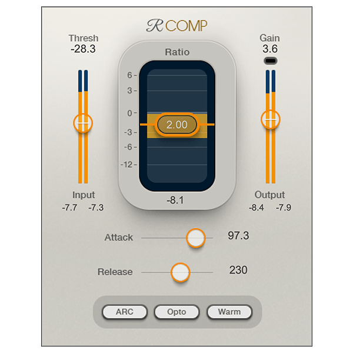

# G3X RComp

G3X RComp é um compressor/expander musical de uso geral, em fase de
planejamento. A entrega inicial será um VST3 64-bit para Windows, desenvolvido
em C++20 com JUCE e CMake, com Standalone para desenvolvimento.

## Estado

**M0 — definição do produto aguardando confirmação.**

- [PRD](PRD.md)
- [Referência visual e fontes](docs/references/README.md)
- [Captura da interface de referência](docs/references/waves-renaissance-compressor-interface.png)

O Waves Renaissance Compressor foi estudado para entender fluxo e categoria.
DSP, marca, código, interface, textos, componentes e presets serão originais.

